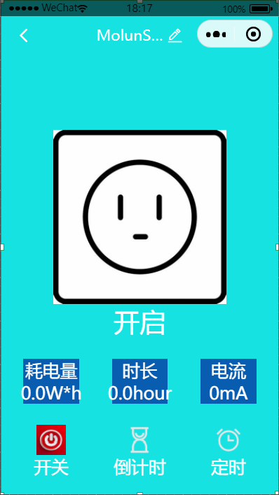

# cdx-zhinca-atc-v1
This is a smart socket library, mainly used to control the smart socket of small programs

This project is developed using Tuya SDK, which enables you to quickly develop branded apps connecting and controlling smart scenarios of many devices. For more information, please check Tuya Developer Website.

